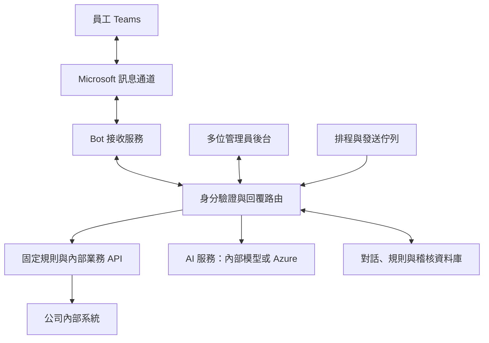

**你的需求可以實現，而且適合規劃成「Teams 企業服務窗口」：把自動回覆、排程通知、多人對話管理與 AI 整合在同一套服務中。**

依你具備 Python 開發能力、公司有自架伺服器，也願意長期採用 Microsoft 雲端服務的條件，我建議優先比較兩條路：

- **自行掌握系統與資料：Teams Bot＋自架對話後台＋Python 服務，AI 選用內部模型或 Azure OpenAI。**
    
- **採購完整企業平台：Dynamics 365 Contact Center／Customer Service＋Copilot Studio，使用官方 Teams 通道。**
    

其中，**Copilot Studio 單獨使用，還不足以涵蓋你要的多人收件匣與人工接手體驗**。以下依查到的官方資料，說明差異。

**先確認隱私權的邊界**

只要透過 Teams 聊天，訊息就會經過 Microsoft 雲端；即使機器人與 AI 都架在公司，Teams 中出現的提問、回覆與附件，也不能宣稱完全留在公司內網。Teams 資料位置可在 Microsoft 365 管理中心查看。[Microsoft：Teams 資料儲存位置](https://learn.microsoft.com/en-us/microsoftteams/privacy/location-of-data-in-teams)

因此，可以將你的隱私需求具體化為：

|資料類型|建議處理方式|
|---|---|
|Teams 中的提問、回覆|接受在公司核准的 Microsoft 365 環境處理|
|公司制度、內部知識文件原檔|留在公司伺服器，或核准的 Microsoft 儲存服務|
|人事、薪資、考勤等個人資料|由後端依身分與職權查詢，避免整批送入 AI|
|提供 AI 的文件片段|依資料分類，送內部模型或核准的 Azure 模型|
|對話紀錄、管理員操作紀錄|明訂可見範圍、保存期限、刪除與備份規則|

**「不拿資料訓練模型」「不儲存資料」「資料不離開公司」是三個不同要求。**選型時要分開確認。

---

**三種方案的比較**

以下「需開發」是指需要自行補上功能，並非產品原生提供。

| 比較項目        | Copilot Studio＋Power Automate | Dynamics 365＋Copilot Studio | 自架後台＋Python Teams SDK |
| ----------- | ----------------------------- | --------------------------- | --------------------- |
| Teams 對話    | 官方支援                          | 官方 Teams 通道                 | 透過官方 SDK 開發           |
| 自動回覆、問答流程   | 可設定                           | 可搭配 Copilot Studio          | 後台規則或自行開發             |
| 排程提醒        | Power Automate                | 另整合排程與發送流程                  | 自行開發，彈性高              |
| 多人管理對話、分派案件 | 需補接手平台／後台                     | 有客服工作台與分派機制                 | 可用 Chatwoot 或自建       |
| 人工在原對話回覆    | 需整合接手機制                       | 官方支援 Teams 人工對話             | 透過 Bot 轉送人工訊息         |
| 所有設定集中一個介面  | 通常涉及多個管理介面                    | 功能完整，但仍有不同管理介面              | 可以做到，需整合開發            |
| 後端資料放公司內部   | 有限，核心平台為雲端                    | 核心平台為雲端                     | 可控制後台、資料庫及模型          |
| 長期主要成本      | 用量、授權、整合                      | 人員席次、容量、導入                  | 開發維護、主機、選用授權          |
| 最適合         | 自助問答、通知為主                     | 多部門服務台、正式營運                 | 客製流程與資料控制優先           |

官方依據：[Copilot Studio 人工接手](https://learn.microsoft.com/en-us/microsoft-copilot-studio/advanced-hand-off)、[主動通知](https://learn.microsoft.com/en-us/microsoft-copilot-studio/advanced-proactive-message)、[Dynamics 365 Teams 通道](https://learn.microsoft.com/en-us/dynamics365/customer-service/administer/configure-microsoft-teams)、[Chatwoot API 收件匣](https://www.chatwoot.com/hc/user-guide/articles/1677839703-how-to-create-an-api-channel-inbox)。

**方案一：Microsoft 官方完整平台，適合長期跨部門營運**

組合可以是：

**Teams＋Dynamics 365 Contact Center Digital／具備相應通道授權的 Customer Service＋Copilot Studio＋排程流程。**

Microsoft 官方明確將 Teams 通道定位於**企業內部 IT、人資、財務支援**。員工在 Teams 發起對話，服務人員在工作台接收、處理與回覆，並可設定分派規則、快速回覆及 AI。[官方設定文件](https://learn.microsoft.com/en-us/dynamics365/customer-service/administer/configure-microsoft-teams)

管理員／服務人員能在工作台查看對話、做筆記、搜尋逐字紀錄，並接手 Teams 聊天。這是目前查到最貼近你需求的 Microsoft 現成方案。[官方工作台使用方式](https://learn.microsoft.com/en-us/dynamics365/customer-service/use/teams-channel)

需要注意兩個地方：

- **人工接手既有對話，與主動發起提醒是不同能力。**排程提醒、人工主動通知，以及是否能共用同一個 Bot 身分和對話紀錄，應列為導入概念驗證的重點。
    
- **同一產品生態不代表所有操作都在同一頁。**客服接待、AI 流程編輯、排程管理可能分屬不同介面；若要求像 LINE 官方帳號般集中操作，仍可能要增加入口或客製頁面。
    

費用方面，查詢時美國官網列出的 **Contact Center Digital 為 US$95／使用者／月，年繳**，數位訊息容量另有 Copilot Studio 購買要求。這只能作為初步預算基準，完整授權需依服務人員、管理角色、AI 用量與台灣報價確認；既有 Teams 訂閱不代表已包含這些功能。[官方價格與附註](https://www.microsoft.com/en-us/dynamics-365/products/contact-center/pricing)

**我的判斷：若未來會擴及人資、IT、財務等多個窗口，且希望有原廠及導入商支援，這條路值得正式詢價。**

**方案二：自架 Chatwoot＋Python Teams Bot，適合你先做驗證**

Chatwoot 是可自架的對話管理平台，可以把它當成「多人共用收件匣」。官方提供 API Channel，能建立聯絡人、對話、訊息，並用 callback 將新訊息通知你的服務。[自架文件](https://developers.chatwoot.com/self-hosted)、[API Channel 文件](https://www.chatwoot.com/hc/user-guide/articles/1677839703-how-to-create-an-api-channel-inbox)

**此方案應按「Teams 客製串接」估算，不能當成安裝 Chatwoot 就能直接使用 Teams。**

你需要開發的 Python 中介服務負責：

1. 接收 Teams Bot 訊息，驗證來源與公司租戶。
    
2. 將 Teams 使用者、對話 ID 對應到 Chatwoot。
    
3. 把員工訊息寫入收件匣。
    
4. 將管理員回覆透過同一個 Bot 送回 Teams。
    
5. 控制自動回覆、AI 回覆及人工接手狀態。
    
6. 執行排程，並記錄成功、失敗與重試結果。
    

Chatwoot 本身有規則式自動化，可以依事件與條件執行動作；但公司工作日計算、每月提醒、主管未簽核等排程，建議由你的服務處理，再提供簡單的管理表單。[Chatwoot 自動化文件](https://www.chatwoot.com/hc/user-guide/articles/1677689800-how-to-use-automation)

授權與隱私有兩個實際限制：

- 自架免費版不包含官方列出的進階 Roles & Permissions、SSO／SAML；需要依管理員分權要求評估付費版。
    
- **自架 Chatwoot 不等於其 AI 也在本地。**官方價格頁說明 Captain AI 會連接 OpenAI 模型；若要求內部推論，應另接你控制的 AI 服務，並檢查外部整合及遙測設定。[Chatwoot 自架方案比較](https://www.chatwoot.com/pricing/self-hosted-plans)
    

若你要求「排程、回覆規則、對話全部在同一個介面」，這部分要明列為開發範圍。Chatwoot 可以減少收件匣的開發量，但完整統一後台仍需整合。

**方案三：完全自行開發後台，可做為客製程度更高的選項**

以你的背景，Python 足以完成主要服務：

|元件|建議職責|
|---|---|
|Microsoft 365 Agents SDK／Teams SDK|Teams 訊息收發與互動|
|Python Web API|權限驗證、業務邏輯、內部系統串接|
|管理後台|對話、人工回覆、規則、排程與管理員設定|
|關聯式資料庫|對話對應、排程、分派狀態、操作紀錄|
|排程與背景工作服務|定時發送、重試、防止重複通知|
|AI 服務|有需要時才執行檢索與生成|

Microsoft 365 Agents SDK 有 Python 支援，也允許整合不同 AI 元件。[Python SDK 文件](https://learn.microsoft.com/en-us/python/api/agent-sdk-python/agents-overview?view=agent-sdk-python-latest)

新專案選 SDK 時，要避開仍以舊 Bot Framework SDK 為核心的過時教學：Microsoft 已公告其 SDK／Emulator 封存，支援工單於 2025 年底停止，並引導使用 Agents SDK 或 Teams SDK。**這不代表 Azure Bot Service 本身停止服務。**[Microsoft 公告](https://learn.microsoft.com/en-ie/azure/bot-service/bot-builder-howto-proactive-message?view=azure-bot-service-4.0)

這條路可精準符合你的介面與權限要求，但對話分派、即時更新、人工接手、搜尋與維運都需要自己負責。

---

**建議的部署架構：內部資料服務＋可替換的 AI**

以下是自架／客製路線的建議設計，不是某個產品安裝後自動具備的功能。

部署時可以有兩種安排：

- **公司主機為主：**Bot 接收入口放在受控的對外區域，資料庫、管理後台、AI 和業務 API 留在內網。
    
- **Azure＋公司內網：**Bot 接收服務放 Azure，透過核准的私有連線存取內部 API；後台及資料庫依公司政策選擇位置。
    

標準 Bot 整合需要設定 Microsoft 能送達的訊息端點；只把服務放在公司 LAN、沒有可達入口或中繼，無法完成訊息接收。[官方部署與端點設定](https://learn.microsoft.com/en-us/microsoft-365/agents-sdk/deploy-azure-bot-service-manually)

若採 Azure 模型，可使用支援的私有端點與網路限制控制存取，但這仍屬 Microsoft 雲端處理。[官方網路設定](https://learn.microsoft.com/en-us/azure/ai-services/cognitive-services-virtual-networks)

**人工訊息應該怎麼運作？**

你要的操作方式可以設計為：

> 管理員各自登入後台 → 開啟員工對話 → 按「接手」→ 輸入人工回覆 → 系統透過「公司小幫手」Bot 發出。

在自建方案中，Teams 顯示的發送者仍是 Bot，可以在內文標註「人資服務人員回覆」；後台則保留真正操作人的帳號。管理員不需要共用一組 Microsoft 帳密。

接手後要暫停該對話的自動生成，直到管理員結案或交回機器人。發送前也要再次檢查狀態，避免已在背景生成的 AI 回覆與人工訊息同時送出。

**「必要時才用 AI」應直接寫成系統規則**

|情境|建議處理|
|---|---|
|固定問題、選單、表單連結|固定回覆|
|到期提醒、未完成事項通知|排程與確定性規則|
|個人考勤／申請進度|驗證身分後查內部 API|
|公司制度的自然語言提問|檢索有權查看的文件，再交給 AI 整理|
|找不到依據、特殊案件、要求真人|轉人工|
|已被人工接手|停止自動回覆|

這樣可讓多數流程在 AI 不可用時仍然運作，也方便控制費用。

---

**Azure AI 是否符合公司資料隱私？**

可以納入，但需要逐項確認，不能只看「企業版」名稱。

Microsoft 對其 Azure 販售模型——包含 Azure OpenAI——說明：輸入、輸出等資料不提供給其他客戶或底層模型供應商，未經許可不拿來訓練基礎模型。另一方面，部分具狀態功能會儲存內容，濫用監測也可能涉及資料留存及受控人工審查；Global、DataZone 與一般部署的處理地域不同。[官方資料隱私說明](https://learn.microsoft.com/en-us/azure/foundry/responsible-ai/openai/data-privacy)

因此，建議採取以下設計：

- **權限由程式判斷。**查詢「我的資料」時依驗證後的員工身分取資料，不能讓 AI 自行決定查誰。
    
- **先篩權限，再把文件交給 AI。**避免檢索到其他部門機密後才試圖遮蔽。
    
- **管理員分權。**能設定提醒，不應自動取得所有人事對話的閱讀權。
    
- **敏感明細用內部連結開啟。**Teams 通知可只顯示「你有待處理事項」，詳細內容登入內部系統查看。
    
- **檢查整條資料路徑。**包含文件解析、向量化、模型、應用日誌、附件及備份；本地模型只涵蓋其中一段。
    

**實際落地建議**

我會先以 **「Python Bot＋自架 Chatwoot／輕量自建後台」做概念驗證，同時向 Microsoft 導入商詢問 Dynamics 365 Digital 方案**。這能用相同的需求比較開發與採購成本。

第一版驗證以下六件事即可：

1. 兩位管理員各自登入，共同管理同一個服務窗口。
    
2. 員工提問、人工接手、回覆，全程維持同一段 Teams 對話。
    
3. 固定回覆與人工接手不互相干擾。
    
4. 排程提醒可設定對象與時間，失敗可追蹤，重試不重複發送。
    
5. 不同員工與管理員只能看到授權資料。
    
6. AI 回覆有文件依據，關閉 AI 後基本服務仍可運作。
    

Teams 主動通知有安裝及存取前提，不能只拿到員工 email 就假設能發送。Copilot Studio 的主動通知目前還有「限與 Agent 的個人聊天」「不出現在其對話逐字紀錄及分析資料」等限制，若要統一管理通知歷史，需另外記錄。[Teams 主動訊息](https://learn.microsoft.com/en-ie/microsoftteams/platform/bots/how-to/conversations/send-proactive-messages)、[Copilot Studio 限制](https://learn.microsoft.com/en-us/microsoft-copilot-studio/advanced-proactive-message)

**以目前資訊，我偏向混合部署的客製方案；若預期多部門長期營運、重視原廠支援，則提高 Dynamics 365 的優先度。**下一步最影響選型的資料是：員工與管理員人數、現有 Microsoft 授權名稱、伺服器規格，以及公司允許哪些資料送至 Azure AI。